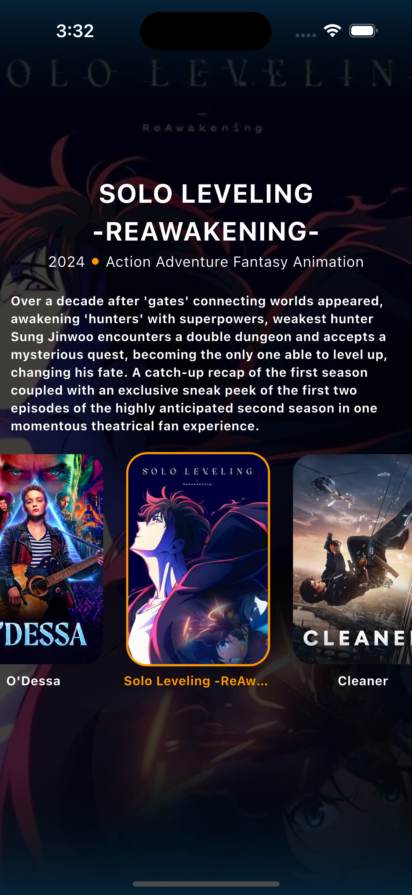
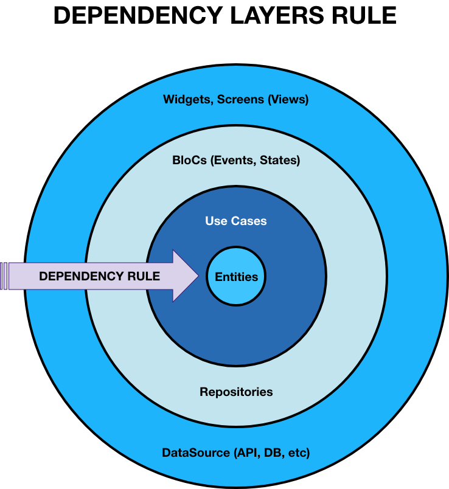
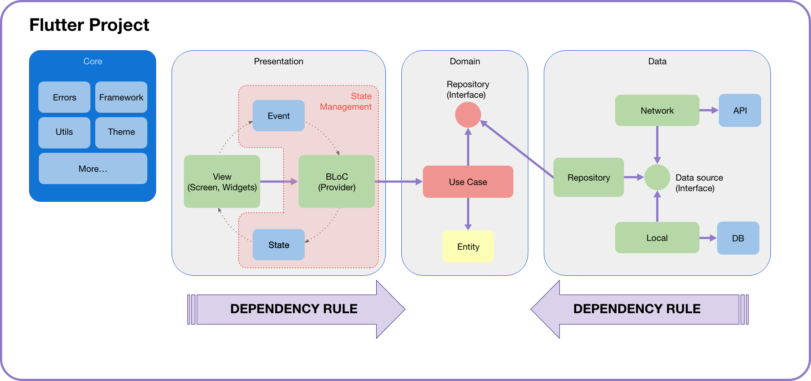
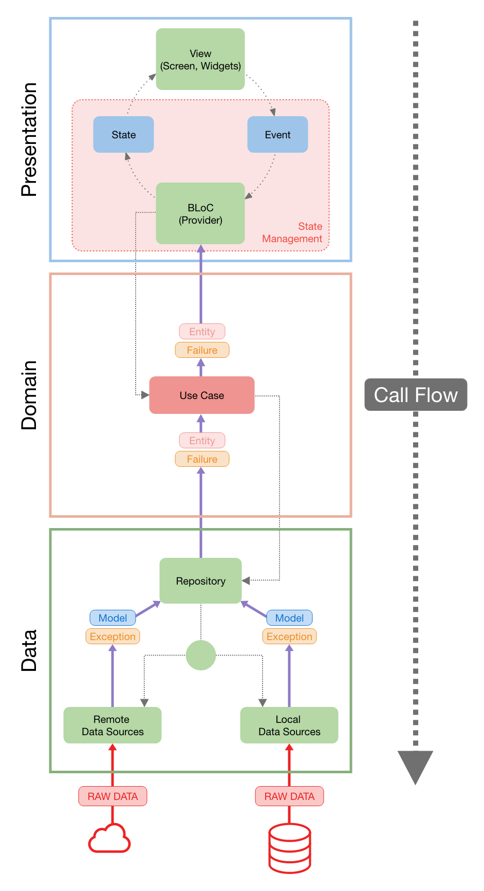

# Kueski Challenge

![coverage][coverage_badge]
[![style: very good analysis][very_good_analysis_badge]][very_good_analysis_link]
[![License: MIT][license_badge]][license_link]


The task is to implement a small app that will list the most popular movies movies using
themoviedb.org API. Also, you must see the details of the film.
You'll be fetching the sorted JSON data directly from the themoviedb.org API (API explained down
below).

### Features
- As a User I should be able to list the most popular movies.
- As a User I should be able to see for each movie the following details:
    - Name
    - Poster
    - Genres
    - Overview
    - Release date

### Preview 

---

## Setting up Flutter Environment in Visual Studio Code for Android and iOS Development

In this section, we'll walk you through the necessary steps to configure Visual Studio Code for Flutter development, ensuring a smooth and productive workflow.

### Prerequisites

Before diving in, ensure you have the following prerequisites installed:

- [Flutter SDK](https://flutter.dev/docs/get-started/install) (version 3.27.3)
- [Visual Studio Code](https://code.visualstudio.com/)


### Installing Flutter and Dart Plugins

To enhance your development experience, make sure to install the Flutter and Dart extensions for Visual Studio Code. These extensions provide invaluable features such as code completion, debugging support, and project scaffolding.

Recommended extensions:

1. **Flutter**: The official Flutter extension from the Flutter team. It provides features like syntax highlighting, widget tree visualization, debugging support, and more.

2. **Dart**: Developed by the Dart team, this extension offers rich language support for Dart, including code formatting, analysis, and refactoring tools.

3. **Pubspec Assist**: This extension assists in managing dependencies in your `pubspec.yaml` file. It provides autocomplete suggestions and version information for packages from pub.dev.

4. **Flutter Widget Snippets**: This extension provides a collection of useful snippets for creating Flutter widgets quickly. It includes shortcuts for common widgets, reducing boilerplate code.

5. **Flutter Intl**: Simplify internationalization (i18n) and localization (l10n) in your Flutter app with this extension. It helps manage localization files and generates localization code.

6. **Awesome Flutter Snippets**: Another snippets extension for Flutter that offers shortcuts for various Flutter widgets, methods, and properties. It enhances productivity by reducing manual typing.

7. **Flutter DevTools**: This extension integrates Flutter DevTools into Visual Studio Code, allowing you to debug and profile your Flutter apps directly from the editor.

8. **Bracket Pair Colorizer 2**: While not specific to Flutter, this extension enhances code readability by colorizing matching brackets, making it easier to navigate nested widget structures in Flutter code.

9. **Flutter SVG Viewer**: This extension enables Visual Studio Code to preview SVG files directly within the editor. It's useful for working with vector assets in Flutter projects.

10. **Error Lens**: Error Lens visually annotates errors, warnings, and other diagnostics directly within your code. It helps you quickly identify and address issues in your Flutter codebase.

11. **Bloc**: VSCode support for the Bloc Library and provides tools for effectively creating Blocs and Cubits for both Flutter and AngularDart apps.


## Cubit State Management in Flutter

Cubit is a lightweight and flexible state management solution for Flutter applications, inspired by the BLoC pattern. It promotes a more straightforward and predictable approach to managing application state, helping developers build robust and maintainable Flutter apps.

### Key Features of Cubit:

- **Minimal Boilerplate**: Cubit reduces boilerplate code by separating concerns and providing a clear separation between business logic and presentation layers.

- **Reactive Programming**: It leverages Dart's Streams and StreamControllers to enable reactive programming, ensuring that UI components update automatically in response to state changes.

- **Immutable State**: Cubit encourages the use of immutable state objects, which helps prevent unintended mutations and simplifies debugging.

- **Testability**: With Cubit, it's easy to write unit tests for business logic without needing to interact with the UI layer. This promotes test-driven development (TDD) and improves overall code quality.

- **Dependency Injection**: Cubit seamlessly integrates with popular dependency injection libraries like `get_it` or `provider` to manage dependencies and improve code organization.

### When to Use Cubit:

- **Small to Medium-sized Apps**: Cubit is well-suited for small to medium-sized Flutter applications where the complexity of using a full-fledged state management solution like BLoC might be overkill.

- **Scalable and Maintainable Apps**: It's ideal for projects that require scalability and maintainability, as Cubit promotes clean architecture principles and separation of concerns.

- **Team Collaboration**: Cubit's simplicity and declarative approach make it suitable for team collaboration, allowing developers to understand and reason about the codebase more easily.

### Getting Started with Cubit:

To start using Cubit in your Flutter projects, you can add the `flutter_bloc` package to your `pubspec.yaml` file and follow the official documentation to learn about its core concepts and best practices.

```yaml
dependencies:
  flutter_bloc: ^8.1.4
```

## Conventions
Concrete recommendations for styles, practices, and programming methods are defined. These conventions encompass file management, indentation, comments, declarations, statements, spacing, naming conventions, programming best practices, programming principles, architecture best practices, etc. These are guidelines for the structural quality of the software. Software developers are strongly encouraged to follow these guidelines to help improve the readability of their source code and facilitate software maintenance.

- Class names in Pascal Case (HomeMenuScreen)
- Method, function, and routine names in Camel Case (loginWithEmailAndPassword())
- Private variables start with _ (_textController)
- Private methods, functions, and routines start with _ (_loginWithEmailAndPassword())
- File and folder names in Snake Case (file_name.dart)
- Constant names in Snake Case and uppercase (URL_ENDPOINT)
- Names of variables, constants, classes, etc. strictly in ENGLISH
- Line comments and comment blocks in ENGLISH
- Methods, functions, and routines should not exceed 100 lines; if it's larger than that, the code needs to be modularized.
- Work with SOLID principles
- Work with the DDD (Domain-Driven Design) approach
- Work in layers (Presentation - Domain - Data)
- Perform all unit tests before making a pull request from a branch to develop
- If a block of code is used more than twice, it should be converted into a class or a function
- Variable, constant, method, class, and function names should be descriptive
- Perform tests on both Android and iOS
- Use Cubit as State Management

## Architecture
This project is based on the rules of Clean Architecture.

### Dependency Rules

Below is a diagram showing the flow of dependencies, which outlines the main elements that the project depends on. The library used for dependency management is:
```
 get_it: ^8.0.3
```


## Layered Architecture

Below is a diagram of the layered structure of the project, that is, the division generated in Domain, Presentation and Data, this also tells us that the dependency of the project is oriented to the domain layer, this being the layer that when changing generates a large structure of the project.



- The Presentation layer shows the flow that exists in the State Management to manage the interaction with the user through events and thus generate the states of the views.
- The dominion layer shows that the main management structure is the entities (entity) and that the project depends 100% on the use cases generated after prior planning. It also shows us that it is the one who dictates the operation of the repositories through interfaces.
- The Data layer manages the data through the implementation of the repository and selects the data depending on the Data Source that is desired to be used.

## Data flow

The following diagram shows the flow of calls that are made when a user executes an event in the UI and it propagates to the data sources.
It also shows the way data is returned and the use of Models in the data layer and Entities in the domain layer.



## Project Folder Structure

- **app:** App entry point and material widget start.
- **core:** Common definitions related to the topic, constants and utilities.
- **data:** Local and external data sources and models (API calls)
- **domain:** Main logic of data management through repositories and entities, it also has error handling.
- **l10n:** Translation into English and Spanish. More languages can be added.
- **presentation:** Screens and widgets in general, also here is the state management logic (cubit).

## Before start 🛠️

Request the env.json or update it using env.example.json as template.

## Getting Started 🚀

This project is a starting point for a Flutter application.

- Clone the repository from GitHub

Then run this command to get al packages

`flutter pub get`

This project contains 3 flavors:

- development
- staging
- production

To run the desired flavor either use the launch configuration in VSCode/Android Studio or use the following commands:

```sh
# Development
$ flutter run --flavor development --target lib/main_development.dart --dart-define-from-file env.json

# Staging
$ flutter run --flavor staging --target lib/main_staging.dart --dart-define-from-file env.json

# Production
$ flutter run --flavor production --target lib/main_production.dart --dart-define-from-file env.json
```

_\*Kueski Challenge works on iOS, Android, Web, and Windows._

---

## Running Tests 🧪

To run all unit and widget tests use the following command:

```sh
$ flutter test --coverage --test-randomize-ordering-seed random
```

To view the generated coverage report you can use [lcov](https://github.com/linux-test-project/lcov).

```sh
# Generate Coverage Report
$ genhtml coverage/lcov.info -o coverage/

# Open Coverage Report
$ open coverage/index.html
```

---

## Working with Translations 🌐

This project relies on [flutter_localizations][flutter_localizations_link] and follows the [official internationalization guide for Flutter][internationalization_link].

### Adding Strings

1. To add a new localizable string, open the `app_en.arb` file at `lib/l10n/arb/app_en.arb`.

```arb
{
    "@@locale": "en",
    "counterAppBarTitle": "Counter",
    "@counterAppBarTitle": {
        "description": "Text shown in the AppBar of the Counter Page"
    }
}
```

2. Then add a new key/value and description

```arb
{
    "@@locale": "en",
    "counterAppBarTitle": "Counter",
    "@counterAppBarTitle": {
        "description": "Text shown in the AppBar of the Counter Page"
    },
    "helloWorld": "Hello World",
    "@helloWorld": {
        "description": "Hello World Text"
    }
}
```

3. Use the new string

```dart
import 'package:kueski_challenge/l10n/l10n.dart';

@override
Widget build(BuildContext context) {
  final l10n = context.l10n;
  return Text(l10n.helloWorld);
}
```

### Adding Supported Locales

Update the `CFBundleLocalizations` array in the `Info.plist` at `ios/Runner/Info.plist` to include the new locale.

```xml
    ...

    <key>CFBundleLocalizations</key>
	<array>
		<string>en</string>
		<string>es</string>
	</array>

    ...
```

### Adding Translations

1. For each supported locale, add a new ARB file in `lib/l10n/arb`.

```
├── l10n
│   ├── arb
│   │   ├── app_en.arb
│   │   └── app_es.arb
```

2. Add the translated strings to each `.arb` file:

`app_en.arb`

```arb
{
    "@@locale": "en",
    "counterAppBarTitle": "Counter",
    "@counterAppBarTitle": {
        "description": "Text shown in the AppBar of the Counter Page"
    }
}
```

`app_es.arb`

```arb
{
    "@@locale": "es",
    "counterAppBarTitle": "Contador",
    "@counterAppBarTitle": {
        "description": "Texto mostrado en la AppBar de la página del contador"
    }
}
```

### Generating Translations

To use the latest translations changes, you will need to generate them:

1. Generate localizations for the current project:

```sh
flutter gen-l10n --arb-dir="lib/l10n/arb"
```

Alternatively, run `flutter run` and code generation will take place automatically.

[coverage_badge]: coverage_badge.svg
[flutter_localizations_link]: https://api.flutter.dev/flutter/flutter_localizations/flutter_localizations-library.html
[internationalization_link]: https://flutter.dev/docs/development/accessibility-and-localization/internationalization
[license_badge]: https://img.shields.io/badge/license-MIT-blue.svg
[license_link]: https://opensource.org/licenses/MIT
[very_good_analysis_badge]: https://img.shields.io/badge/style-very_good_analysis-B22C89.svg
[very_good_analysis_link]: https://pub.dev/packages/very_good_analysis
[very_good_cli_link]: https://github.com/VeryGoodOpenSource/very_good_cli

## **Commits Messages Convention**

The Conventional Commits specification is a lightweight convention on top of commit messages. It provides an easy set of rules for creating an explicit commit history; which makes it easier to write automated tools on top of. This convention dovetails with **[SemVer](http://semver.org/)**, by describing the features, fixes, and breaking changes made in commit messages.

The commit message should be structured as follows:

```
<type>[optional scope]: <description>

[optional body]

[optional footer(s)]
```

[Conventional Commits](http://www.conventionalcommits.org/en/v1.0.0/)
